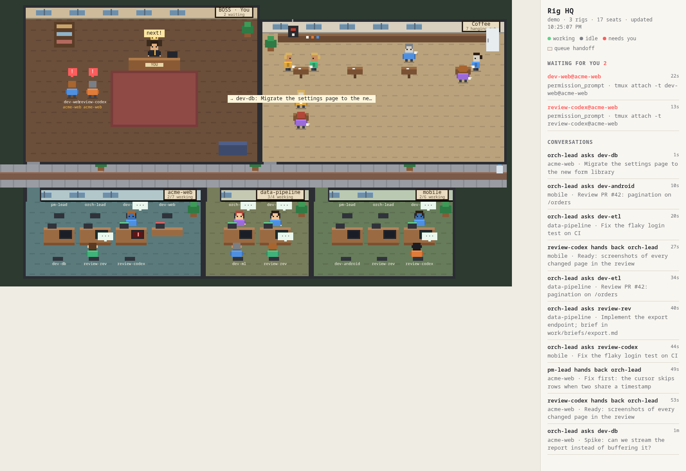

# Rig HQ

A pixel-art office for your [OpenRig](https://openrig.dev) agent teams. Every rig is a room off a hallway, every seat is a little person at a desk, and you have the corner office.



**Where someone is tells you their state:**

- **At their desk:** working. They type, their screen scrolls green, and a "…" bubble floats over them.
- **In the coffee room:** idle, mug in hand. A seat heads there 15 seconds after going idle, so quick hand-offs don't send people back and forth.
- **Queued at your door:** they need you: a permission or selection prompt, or the seat is held, errored or flagged for attention. This follows the same rule as `rig ps`'s attention count. They line up in the order they started waiting, with a red "!", and the side panel lists each one with its `tmux attach` command. Answer the prompt and they walk back.

**Conversations:** when a seat creates or hands off a queue item, an envelope flies from sender to recipient; a direct `rig send` message flies as a blue note. Either way the sender says what it's about. When one seat answers another seat's prompt, a yellow card flies and the seat walks over to that desk for a while. The side panel keeps the last few hours; click one to replay it.

**Moments:** "got it" pops over a seat when it claims a queue item, and "✓ done" when it closes one. (An item closed by handing it on shows as the hand-off envelope instead.)

Hover anyone for their runtime, pod, state and work counts. Claude seats wear their pod's colour; Codex seats wear orange with a visor.

**Watch a seat's screen:** click anyone (or a name in the waiting list) to open their terminal, live and in colour. It's view only: Rig HQ reads the seat's tmux pane and never types into it. Scroll up to read back and updates pause until you scroll down again; Esc closes it. This needs Rig HQ on the same machine as the rigs.

## Run it

Needs Node 22 or later and a running OpenRig daemon. No dependencies to install.

```sh
git clone https://github.com/dmelo/rig-hq && cd rig-hq
node server.mjs               # http://127.0.0.1:7480
```

No OpenRig yet, or just curious? Start it with invented rigs:

```sh
node server.mjs --demo
```

| Variable | Default | |
|---|---|---|
| `PORT` | `7480` | where the office is served |
| `HOST` | `127.0.0.1` | bind address; the page and its event stream have no auth, so keep it on loopback unless you trust the network |
| `DAEMON` | `http://127.0.0.1:7433` | the OpenRig daemon |
| `RIG_HQ_BOSS` | `You` | the name on your office door (`?boss=Name` in the URL overrides it for one page) |
| `RIG_HQ_ALLOWED_HOSTS` | | extra host names to answer to, comma-separated. Rig HQ only answers requests addressed to this machine (loopback, its hostname, its IP addresses), so a web page can't reach it through DNS rebinding; behind a reverse proxy with its own name, add that name here |
| `RIG_HQ_SCREENS` | on | `off` hides seat screens. A screen shows whatever the agent printed, secrets included, to anyone who can open the page |
| `DEMO` | | `1` for demo mode, same as `--demo` |

If the rigs run on another machine, tunnel the port: `ssh -N -L 7480:127.0.0.1:7480 <host>`, then open `http://localhost:7480`.

## How it works

`server.mjs` is a small read-only bridge; it never writes to the daemon.

- Every 4 seconds it reads the rigs (`/api/ps`) and each rig's seats (`/api/rigs/:id/nodes`). Working or idle is the daemon's reconciled activity (`activityState.display`, what `rig ps` and the OpenRig TUI show). "Needs you" mirrors the daemon's attention rule: a pending-input count, or the raw hook state for runtimes whose "nothing pending" isn't trusted yet (Codex, in 0.6.5), or a held, errored or flagged seat. The seat list doesn't say which runtimes are trusted, so Rig HQ assumes only Claude Code is.
- It follows the daemon's event stream (`/api/events`) for queue traffic (`queue.created`, `queue.handed_off`, `queue.claimed`, and `queue.updated` to done) and for one seat answering another's prompt (`transport.prompt_override`). Activity events (`agent.activity`, `seat.activity_changed`) only trigger an early re-read, never a state change by themselves. The first connection replays the daemon's retained history; reconnects resume with `Last-Event-ID`.
- Every 5 seconds it reads each seat's outbox (`/api/queue/outbox/list?senderSession=…`) for `rig send` messages. Sends without a sender session aren't recorded there, so they don't show.
- It serves `public/` and pushes state and conversations to every open page over server-sent events (`/api/stream`).
- A seat's screen comes from `tmux capture-pane`, read twice a second and sent only when it changes (`/api/pane`). Only seats the daemon lists can be opened, and tmux is called without a shell.

The page is plain JavaScript on a `<canvas>`. All the art is drawn in code, so there are no image assets. The screen panel uses [xterm.js](https://xtermjs.org), loaded from jsDelivr.

## Limits

- **Tested with OpenRig 0.6.5.** The daemon's HTTP API isn't frozen across releases. Rig HQ ignores fields it doesn't know and shows an unknown state as idle, but a future version may still need changes here.
- Direct messages show up a few seconds late, because the outbox is polled rather than streamed.

## Inspiration

The idea of watching coding agents as pixel people in an office comes from [Pixel Agents](https://github.com/pixel-agents-hq/pixel-agents), which does this for Claude Code sessions. Rig HQ is a separate implementation built around OpenRig's model instead (rigs, pods, seats and their queue), so it can give every rig its own room and show Codex seats too. [claude-office](https://github.com/paulrobello/claude-office) and [Agent Virtual Office](https://github.com/KbWen/agent-virtual-office) explore the same idea. No code or art is taken from any of them.

## License

[MIT](LICENSE)
